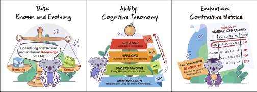

# KoLA
Knowledge-oriented LLM Assessment benchmark (KoLA), is hosted by Knowledge Engineering Group, Tsinghua University (THU-KEG), which aims at carefully benchmarking the world knowledge of LLMs by undertaking meticulous designs considering data, ability taxonomy and evaluation metric.



This repository presents the sample data for easily submission, standardized score calculation and result visualization.

## Join Us

<font color=red>[Updated 2023.6.28: Confidential Submission]</font> We have noticed that some developers of large-scale models wish to make confidential submissions. We welcome you to reach out to us via private message or email, and we will support such evaluations under a confidentiality agreement. However, please note that the results of these evaluations will not be publicly showcased in the second season.

KoLA is currently recruiting datasets and participating models for the second season. If you are interested, we warmly welcome you to contact us via email at [kola-benchmark@googlegroups.com](mailto:kola-benchmark@googlegroups.com) or join our Slack channel at https://join.slack.com/t/kolabenchamrk/shared_invite/zt-1wognxoox-mAgjGYvjL32ZlG7MH6zVuA. The recruitment will close on <font color =#6a3378>July 31st</font>, and the evaluation will commence shortly thereafter, with all results being published and concluded by September 30th.

We are committed to ongoing maintenance of this toolkit and have also established a synchronized [Reading List](https://github.com/THU-KEG/EvaluationPapers4ChatGPT) for evaluating large-scale models. 

## News !!

* [2023.6.30] Season 2nd call for data and model before July 31th. We also support confidential submission (for developers) !
* [2023.6.18]
* [2023.6.13] Our platform is now available at https://kola.xlore.cn/.
* [2023.6.7] Our paper has been submitted to Neurips 2023 (Datasets and Benchmarks Track)
* [2023.5.31] All the results of Season 1st have been published.

## Getting Start

<font color =#6a3378>KoLA currently consists of 19 datasets.</font>  All the functions are now available on our platform:

By logging in with your GitHub account, you will be able to participate in the evaluation tasks by <font color =#6a3378>submitting an API and a custom Config file</font>, i.e.,

* Step 0: Download the Sample Data on this `Tasks` Page
* Step 1: Login with your Github account
* Step 2: Submit a model API on the `Submit` Page
* Step 3: Revise the submission on the `Profile` Page
* Step 4: Waiting for the result on the `Model` Page 
* Step 5: The <font color =#6a3378>Standardized Result</font> will also be refreshed on the `Leaderboard` after the corresponding weekend (Sunday 23:59, UTC+12, anywhere on earth).

It is important to note that the Config file is not mandatory but is provided for your convenience to fine-tune prompts for different tasks. If the Config file is not submitted, the evaluation will still be conducted using the default instructions described in Appendix E of the paper. 

## Data Acquisition

We provide researchers and developers interested in participating in the evaluation with a one-click data download feature. This downloadable file will be continuously updated, enabling developers to conveniently download sample data and data descriptions for all tasks. For more detailed information, you can visit the `Task` page on our website and refer to our paper to learn about the specific datasets used and their corresponding instruction examples.

* Download the [Sample_Data.zip](https://cloud.tsinghua.edu.cn/f/03f03c547fc14ce7a785/?dl=1) here!

This .zip file includes 5 examples for each established task in KoLA, as well as a detailed Readme file for description.

## Result Analysis Tools

To facilitate the reproducibility of the paper's results, we provide tools for each model's absolute performance, as well as a series of operations such as standardization and visualization. These tools can also assist subsequent contributors in obtaining results in advance during the leaderboard waiting period and ensure the fairness of our results.

First, we have put the 21 models' raw evaluation results in `analyse/results/`. 
To get standardization scores, run the following command:

```bash
python analyse/unify.py
```

Then, the standardized results will be saved in `analyse/dataset_final_scores.csv`.

Second, we provide a visualization tool to help you visualize the results. You can run `analyse/plot.ipynb` to get *spearman correlation* and *scatter plots*.


## Citation and Lisence

The project is hosted with the GPLv3 License.

If these sample datasets have been helpful in assisting your participation in the evaluation (or any other research endeavor), we sincerely appreciate it and encourage you to cite the following article(s):

```bibtex
@article{yu2023kola,
  title={KoLA: Carefully Benchmarking World Knowledge of Large Language Models},
  author={Jifan Yu, Xiaozhi Wang, Shangqing Tu, Shulin Cao, Daniel Zhang-Li, Xin Lv, Hao Peng, Zijun Yao, Xiaohan Zhang, Hanming Li, Chunyang Li, Zheyuan Zhang, Yushi Bai, Yantao Liu, Amy Xin, Nianyi Lin, Kaifeng Yun, Linlu Gong, Jianhui Chen, Zhili Wu, Yunjia Qi, Weikai Li, Yong Guan, Kaisheng Zeng, Ji Qi, Hailong Jin, Jinxin Liu, Yu Gu, Yuan Yao, Ning Ding, Lei Hou, Zhiyuan Liu, Bin Xu, Jie Tang, Juanzi Li},
  year={2023},
  url={"https://github.com/THU-KEG/KoLA"}
}
 ```
